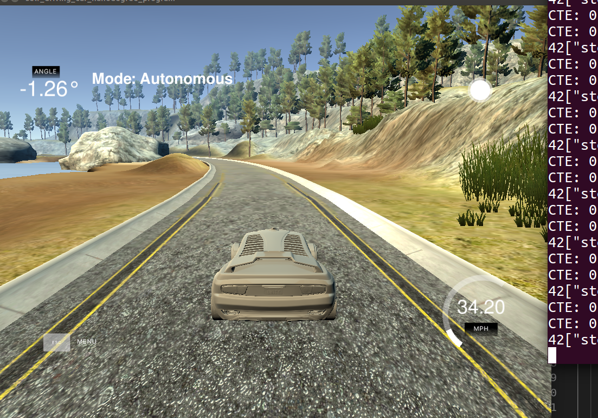

# PID Controller


## the project require to create a PID Controller for the vehicle on the high way.

### PID effectons

1. P Controller is a based controller.

when the car ran with small cte, it had a small oscillation. But when the car truned the curve, the cte became larger and the controller began a big oscillation.


2. D Controller create small cte change rate;

3. I Controller,  It sum a lot of cte;

### To tune a PID, I will take some steps below:

step1:create a PID Controller class, and set the parameter of P's, I's, D's to zero;

step2: increase P gain until the response to a disturbance is steady oscillation;



step3: Increase the D gain until the oscillations go away;


step4: Repeat step2 and step 3, until increasing the D gain does not stop the oscillations;

step5: Increase the I gain until it brings you to the setpoint with the number of oscillations desired(normally zero);


```python

```


```python

```
